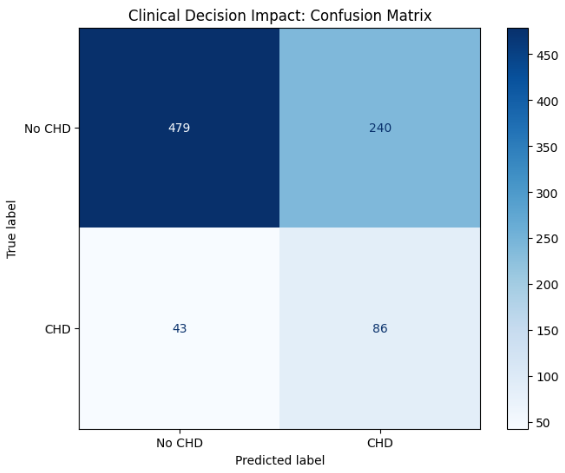
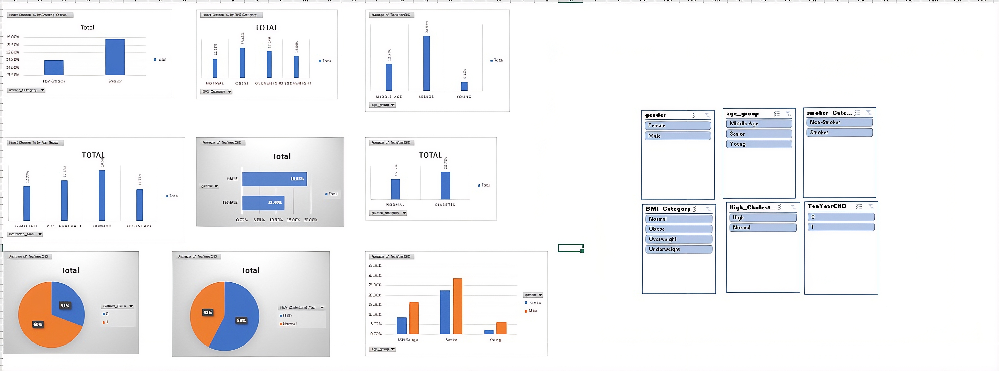
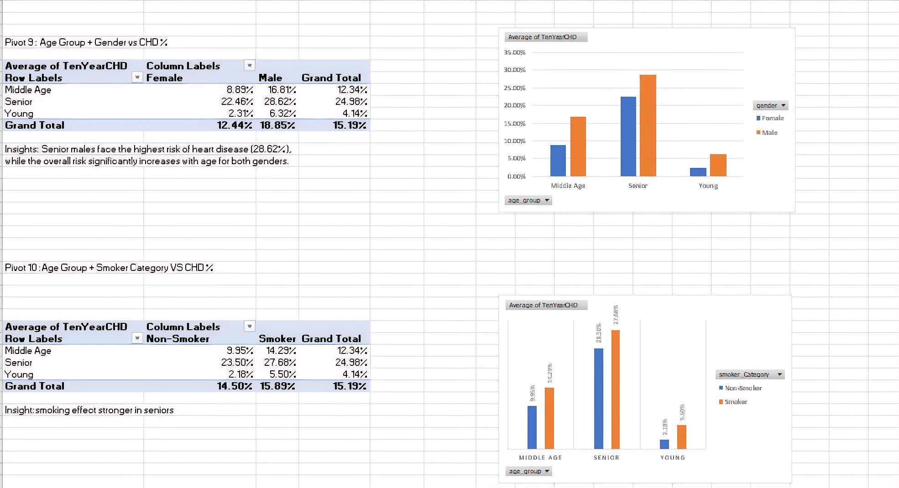

<h1 align="center">🫀 Framingham Heart Disease Analysis</h1>

  <b>End-to-End Data Project | Machine Learning | SQL | Power BI</b> 
  Predicting 10-year heart disease risk using real-world healthcare data

  
  
  

  
  
  
  

---

<h2>📌 Project Overview</h2>

This project is a complete <b>end-to-end data pipeline</b> built using the 
<b>Framingham Heart Study dataset</b>. It integrates data cleaning, SQL analytics, 
machine learning, and dashboarding to predict heart disease risk.

<ul>
  <li>📊 Data Cleaning & KPI creation using Excel</li>
  <li>🗄️ Advanced SQL analysis (CTEs, window functions)</li>
  <li>🤖 Machine Learning models for prediction</li>
  <li>📈 Interactive Power BI dashboard</li>
</ul>

---

<h2>🧰 Tools & Contributions</h2>

<table>
  <tr>
    <th>Tool</th>
    <th>Work Done</th>
  </tr>
  <tr>
    <td>📊 Excel</td>
    <td>Data cleaning, formulas (VLOOKUP, IF, HLOOKUP), pivot tables, KPIs</td>
  </tr>
  <tr>
    <td>🗄️ SQL</td>
    <td>15 advanced queries (CTEs, window functions, ranking, segmentation)</td>
  </tr>
  <tr>
    <td>🤖 Python (ML)</td>
    <td>Built & compared 4 models for prediction</td>
  </tr>
  <tr>
    <td>📈 Power BI</td>
    <td>Interactive dashboard with filters & AI insights</td>
  </tr>
</table>

---

<h2>📂 Dataset</h2>

<b>Framingham Heart Study</b> dataset (~4000+ records) including:

<ul>
  <li>Age, Cholesterol, Blood Pressure</li>
  <li>Smoking habits</li>
  <li>Glucose levels</li>
  <li><b>Target:</b> TenYearCHD (Heart Disease Risk)</li>
</ul>

🔗 <a href="https://www.kaggle.com/datasets/amanajmera1/framingham-heart-study-dataset">View Dataset on Kaggle</a>

---

<h2>🤖 Machine Learning</h2>

<b>Goal:</b> Predict 10-year heart disease risk

<h3>⚙️ Workflow</h3>
<ul>
  <li>KNN Imputation for missing values</li>
  <li>IQR method for outlier capping</li>
  <li>Feature Engineering:
    <ul>
      <li><code>age_bp_interaction</code></li>
      <li><code>smoke_intensity</code></li>
    </ul>
  </li>
  <li>Handled imbalance using <b>SMOTE + Tomek Links</b></li>
  <li>Tested models:
    <ul>
      <li>Logistic Regression ⭐ (Final Model)</li>
      <li>Random Forest</li>
      <li>XGBoost</li>
      <li>Voting Ensemble</li>
    </ul>
  </li>
</ul>

---

<h2>📊 Final Model Performance (Optimized Thresholds)</h2>

Threshold tuning was applied to improve <b>recall</b> for better detection of high-risk patients.

<table>
  <tr>
    <th>Model</th>
    <th>Accuracy</th>
    <th>Recall</th>
    <th>F1-Score</th>
    <th>ROC AUC</th>
  </tr>
  <tr>
    <td><b>Logistic Regression ⭐</b></td>
    <td>0.6663</td>
    <td>0.6667</td>
    <td>0.3780</td>
    <td><b>0.7003</b></td>
  </tr>
  <tr>
    <td>Random Forest</td>
    <td>0.5849</td>
    <td>0.6667</td>
    <td>0.3282</td>
    <td>0.6572</td>
  </tr>
  <tr>
    <td>XGBoost</td>
    <td>0.5991</td>
    <td><b>0.6977</b></td>
    <td>0.3462</td>
    <td>0.6766</td>
  </tr>
  <tr>
    <td>Ensemble</td>
    <td>0.6533</td>
    <td>0.6512</td>
    <td>0.3636</td>
    <td>0.6851</td>
  </tr>
</table>

🏆 <b>Final Choice:</b> Logistic Regression — best balance of performance + interpretability

---

<h2>📸 Visual Insights</h2>

<h3>📊 Model Comparison</h3>

   
  

<h3>🎯 Confusion Matrix</h3>

  

<h3>📉 Calibration Analysis</h3>

  

<h3>🔍 SHAP Explainability</h3>

  

<h3>📊 Excel Dashboard & Pivot Analysis</h3>

   
  

<h3>📊 Power BI Dashboard</h3>

  

---

<h2>🗄️ SQL Analysis</h2>

<ul>
  <li>Risk segmentation by gender & age groups</li>
  <li>Smoking vs heart disease comparison</li>
  <li>Window functions: RANK, NTILE, LAG, ROW_NUMBER</li>
  <li>CTEs for advanced filtering</li>
  <li>Trend analysis using moving averages</li>
</ul>

📄 File: <code>sql/heart_disease_queries.sql</code>

---

<h2>📑 Excel Workbook</h2>

<ul>
  <li><b>framingham:</b> cleaned dataset with formulas</li>
  <li><b>LookUP_Table:</b> education mapping</li>
  <li><b>Pivot Analysis:</b> insights</li>
  <li><b>Dashboards:</b> charts</li>
  <li><b>KPIs:</b> summary metrics</li>
</ul>

---

<h2>🧠 Business Insights</h2>

<ul>
  <li>📈 Risk increases significantly with <b>Age + Blood Pressure interaction</b></li>
  <li>🚬 Smokers have higher probability of heart disease</li>
  <li>🧪 Cholesterol and glucose are strong predictors</li>
  <li>⚠️ Lowering threshold helped detect more high-risk patients</li>
  <li>👨‍⚕️ Useful as an <b>early screening tool</b></li>
</ul>

---

<h2>📁 Project Structure</h2>

<pre>
framingham-heart-disease-analysis/
├── data/
├── notebooks/
├── python/
├── sql/
├── powerbi/
├── images/
└── README.md
</pre>

---

<h2>⚙️ Tech Stack</h2>

<b>Python:</b> pandas, numpy, scikit-learn, xgboost, shap  
<b>Database:</b> MySQL  
<b>BI Tool:</b> Power BI  
<b>Other:</b> Excel

---

<h2>🚀 How to Run</h2>

<ol>
  <li>Clone the repository</li>
  <li>Install dependencies: <code>pip install -r requirements.txt</code></li>
  <li>Open notebook in Jupyter</li>
</ol>

---

<h2>🚀 Why This Project Stands Out</h2>

<ul>
  <li>✅ End-to-end pipeline (Excel → SQL → Python → Power BI)</li>
  <li>✅ Real-world healthcare use case</li>
  <li>✅ Focus on recall (critical in medical AI)</li>
  <li>✅ Explainable AI (SHAP)</li>
  <li>✅ Multi-tool integration</li>
</ul>

---

<h2 align="center">⭐ If you like this project, give it a star!</h2>